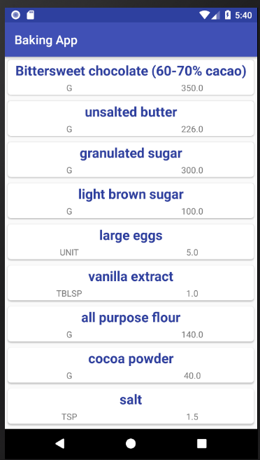

# Baking App

create a Android Baking App that will allow Udacity’s resident baker-in-chief, Miriam, to share her recipes with the world.

## Getting Started

In this project:
* allow a user to select a recipe and see video-guided steps for how to complete it.
* Use MediaPlayer/Exoplayer to display videos.
* Handle error cases in Android.
* Add a widget to your app experience.
* Leverage a third-party library in your app.
* Use Fragments to create a responsive design that works on phones and tablets.

## Built With

* [Picasso](http://square.github.io/picasso/) 
* [Retrofit](https://square.github.io/retrofit/) 
* [ExoPlayer](https://developer.android.com/guide/topics/media/exoplayer) 

